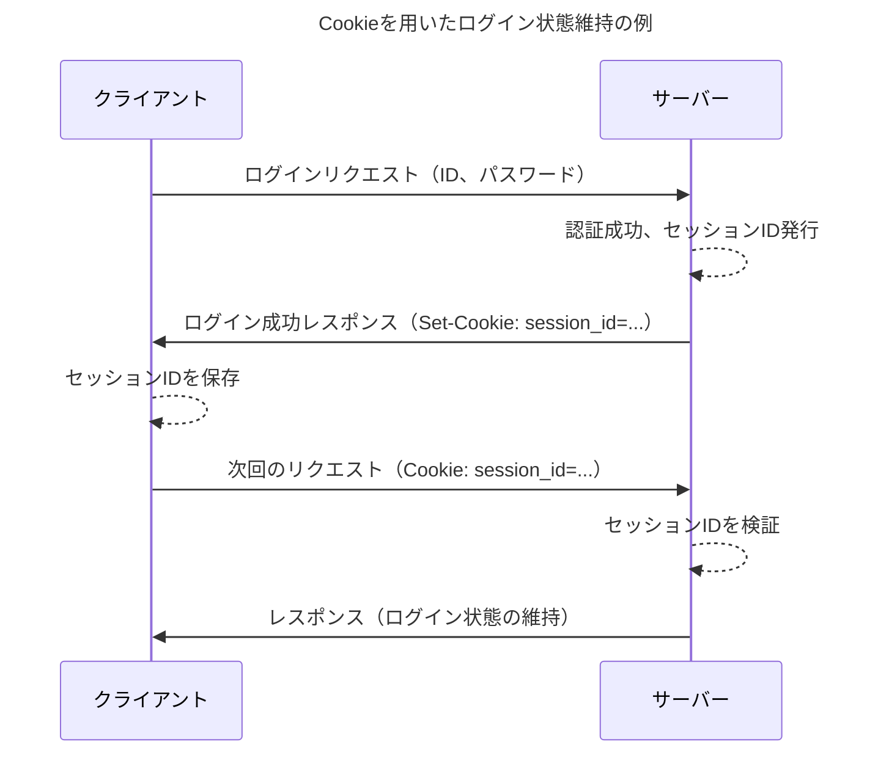

## はじめに

HTTP/1.1の基礎知識を端的にまとめます。

対象読者は、**一度でもHTTPを学んだことがある人**です。  
以下のような要望に応えられる記事です。

- 短時間で復習したい
- 技術面接の対策がしたい
- 忘れた頃にさくっと見返せる情報源が欲しい

初心者向けの資料はすでに世の中にたくさんあるので、それらとは棲み分けています。  
個人的なおすすめは『[Webを支える技術](https://gihyo.jp/book/2010/978-4-7741-4204-3)』です。  

## HTTPとは

HTTPとは Hypertext Transfer Protocol の略で、**Web上でクライアントとサーバーがリソースの表現をやりとりするためのプロトコル**です。

リソースとは、Web上に存在する名前をもつ情報です。  
たとえば、長野県の天気予報リソースなどです。  
URIで一意に識別されます。  

リソースの表現とは、クライアントとサーバーが実際にやりとりするデータです。  
たとえば、長野県の天気予報リソースにおけるJSON形式の文字列データなどです。  
1つのリソースに対して複数の表現があってもOKです。

### アーキテクチャスタイル

HTTPは**クライアント・サーバーのアーキテクチャスタイルを採用**しています。  
Webブラウザなどのクライアントがリクエストを送信し、Webサーバーがレスポンスを返信するというスタイルです。


### ステートレス

HTTPは**ステートレスなプロトコル**です。  
ステートレスとは、サーバーがクライアントのアプリケーション状態を保持しない制約のことです。

つまり、サーバーは以前のリクエストの内容を覚えていません。  
リクエストはそれぞれが独立したものとして扱われます。

- **メリット**: サーバーの実装がシンプル、スケールしやすい
- **デメリット**: ログイン状態や買い物カゴなど、状態の維持が必要な機能が作りづらい

このデメリットを補うために、Cookieを利用してアプリケーション状態を管理する仕組みがあります。

## HTTPメッセージ

HTTPメッセージとは**リクエストメッセージとレスポンスメッセージの総称**で、どちらも似た構造をしています。


  HTTPメッセージの例は [HTTP メッセージ - HTTP | MDN](https://developer.mozilla.org/ja/docs/Web/HTTP/Guides/Messages) から拝借しました。


### リクエストメッセージ

クライアントからサーバーへ送信されるメッセージです。

```http
POST /users HTTP/1.1
Host: example.com
Content-Type: application/x-www-form-urlencoded
Content-Length: 49

name=FirstName+LastName&email=bsmth%40example.com
```

リクエストメッセージは、以下の要素で構成されます。

- リクエストライン
  - HTTPメソッド（後述）
  - リクエストURI
  - プロトコルバージョン
- HTTPヘッダー（後述）
- 空行
- メッセージボディ

メッセージボディには、フォームに入力した内容などが含まれます。

### レスポンスメッセージ

サーバーからクライアントへ返信されるメッセージです。

```http
HTTP/1.1 201 Created
Content-Type: application/json
Location: http://example.com/users/123

{
  "message": "新しいユーザーが作成されました",
  "user": {
    "id": 123,
    "firstName": "例の",
    "lastName": "人物",
    "email": "bsmth@example.com"
  }
}
```

レスポンスメッセージは、以下の要素で構成されます。

- ステータスライン
  - プロトコルバージョン
  - ステータスコード（後述）
  - テキストフレーズ（後述）
- HTTPヘッダー（後述）
- 空行
- メッセージボディ

メッセージボディには、HTML文書などが含まれます。

## HTTPメソッド

HTTPメソッド[^1]とは**クライアントがリソースに対して行いたい処理をサーバーに伝えるもの**です。  
URIが「何を」を示すのに対し、メソッドは「どうする」を示します。

[^1]: 以降、見出しを除き「メソッド」と表記します。

### 主要なHTTPメソッド

よく使われるメソッドとその用途をまとめます。

| メソッド  | 用途                                                     |
| :-------- | :------------------------------------------------------- |
| GET       | リソースの取得                                           |
| POST      | 子リソースの作成、リソースへのデータの追加、その他の処理 |
| PUT       | リソースの全体的な更新、リソースの作成                   |
| PATCH[^2] | リソースの部分的な更新                                   |
| DELETE    | リソースの削除                                           |
| HEAD      | リソースのヘッダーの取得                                 |
| OPTIONS   | リソースがサポートしているメソッドの取得                 |

PUTとPATCHの更新処理の違いについて補足します。  
名前とメールアドレスをもつユーザーリソースを考えます。  
名前とメールアドレス全ての情報をリクエストに載せて置き換えするのがPUTです。  
一方で、名前だけの情報をリクエストに載せて、メールアドレスの値はそのままに名前だけ部分的に更新するのがPATCHです。

OPTIONSメソッドはCORSのプリフライトリクエストで使われます。  
CORSについては [オリジン間リソース共有 (CORS)とは #JavaScript - Qiita](https://qiita.com/Hirohana/items/9b5501c561954ad32be7) がわかりやすいです。

<!-- [【魚拓】オリジン間リソース共有 (CORS)とは #JavaScript - Qiita](https://megalodon.jp/2025-1030-1257-59/https://qiita.com:443/Hirohana/items/9b5501c561954ad32be7) -->

[^2]: PATCHはHTTP1.1の中核となる仕様で定義されていませんが一緒に掲載してしまいます。

他にもCONNECTとTRACEというメソッドがあります。  
CONNECTの用途は [【図解】httpプロキシサーバの仕組み(http GET/https CONNECTメソッド)や必要性・役割・メリットデメリット・DNSの名前解決の順序 | SEの道標](https://milestone-of-se.nesuke.com/nw-basic/grasp-nw/proxy/) がわかりやすいです。  
TRACEの用途は [HTTP TRACEメソッドとは](https://innovative.jp/archives/520) がわかりやすいです。

<!-- [【魚拓】【図解】httpプロキシサーバの仕組み(http GET/https CONNECTメソッド)や必要性・役割・メリットデメリット・DNSの名前解決の順序 | SEの道標](https://megalodon.jp/2025-1030-1259-49/https://milestone-of-se.nesuke.com:443/nw-basic/grasp-nw/proxy/) -->

<!-- [【魚拓】HTTP TRACEメソッドとは](https://megalodon.jp/2025-1030-1302-43/https://innovative.jp:443/archives/520) -->

### HTTPメソッドの特性

各メソッドには冪等性と安全性という重要な性質の有無があります。  
これらの性質の有無と矛盾した実装にすると色々大変なことが起こるので、きちんと理解しておく必要があります。

冪等性とは、**ある操作を何回行っても結果が同じ性質**です。  
たとえば、PUTやDELETEは同じリソースに対して1回実行しようが100回実行しようが、そのリソースの状態は同じになります。  
一方で、POSTは実行のたびに子リソースが増えていく可能性があるので冪等ではありません。  
また、PATCHは冪等であるとは限らないので冪等ではない、という扱いです。

安全性とは、**操作対象のリソースの状態を変化させない性質**です。  
たとえば、GETなど読み取り系のメソッドが安全です。  
一方で、PUTやDELETEなどはリソースの状態を変化させるので安全ではありません。  
また、安全なものは冪等でもあります。

まとめると以下の通りです。

| メソッド | 冪等性 | 安全性 |
| :------- | :----- | :----- |
| GET      | ◯     | ◯     |
| POST     | ×     | ×     |
| PUT      | ◯     | ×     |
| PATCH    | ×     | ×     |
| DELETE   | ◯     | ×     |
| HEAD     | ◯     | ◯     |
| OPTIONS  | ◯     | ◯     |

## ステータスコード

ステータスコードとは、**リクエストの結果を示す3桁の数値コード**です。  
レスポンスメッセージのステータスラインに含まれます。

ステータスコードは、先頭の数字によって5つに分類されます。

| 分類 | 意味               | 説明                                   |
| :--- | :----------------- | :------------------------------------- |
| 1xx  | 処理中             | 処理が継続中であることを示す           |
| 2xx  | 成功               | リクエストが成功したことを示す         |
| 3xx  | リダイレクト       | 他のリソースへのリダイレクトを示す     |
| 4xx  | クライアントエラー | クライアント側に原因があるエラーを示す |
| 5xx  | サーバーエラー     | サーバー側に原因があるエラーを示す     |

### よく使われるステータスコード

特に目にする機会が多いステータスコードが以下です。

| コード | テキストフレーズ      | 説明 |
| :----- | :-------------------- | :--- |
| 200    | OK                    | リクエストが成功したことを示す |
| 201    | Created               | リソースを新たに作成したことを示す |
| 301    | Moved Permanently     | リソースのURIが恒久的に変更されたことを示す |
| 303    | See Other             | 処理結果が別のURIで取得できることを示す[^3] |
| 400    | Bad Request           | リクエストの構文やパラメーターが間違っていたことを示す |
| 401    | Unauthorized          | 適切な認証情報を与えずにリクエストを行ったことを示す |
| 404    | Not Found             | 指定したリソースが見つからないことを示す |
| 500    | Internal Server Error | サーバー側に何らかの異常が生じていて、正しいレスポンスがが返せないことを示す |
| 503    | Service Unavailable   | サーバーが一時的に過負荷やメンテナンス中で利用できないことを示す |

[^3]: たとえば、ブラウザからPOSTでリソースを操作した結果をGETで取得するときに使います。

## HTTPヘッダー

HTTPヘッダー[^4]とは、**クライアントとサーバーがリクエストやレスポンスに関する追加情報やメタデータを伝えるためのフィールド**です。  
`フィールド名: 値`という形式をとります。

[^4]: 以降、見出しを除き「ヘッダー」と表記します。

全てのヘッダーを扱うわけにはいかないので、よく使われるものの中で以下のいずれかに該当するヘッダーのみを解説します。

- **重要機能**: たとえばコンテンツネゴシエーションは重要なので Accept-* 系は解説します
- **難しい**: たとえば Cache-Control は様々な値の取り方があって難しいので解説します
- **上記と深く関連する**: たとえば Set-Cookie という重要かつ難しいヘッダーがありますがそれと深く関連する Cookie も一緒に解説します

逆に少し調べればすぐわかるヘッダーの解説はしません。  
たとえば、Date はよく目にするヘッダーですが単純なので解説しません。

### セッション管理

セッション管理とは、**クライアントとサーバー間でアプリケーション状態を維持するための仕組み**です。  
HTTPはステートレスであるため、各リクエストは独立しており、サーバーは過去のリクエストを覚えていません。  
しかし、Webアプリケーションでは「どのユーザーがログインしているか」や「買い物カゴに何が入っているか」といった状態を保持する必要が時としてあります。  
この問題を解決するために、一般的に Cookie が用いられます。



#### Set-Cookie

Set-Cookie は、**サーバーからクライアントに対してCookieを保存するよう指示**するレスポンスヘッダーです。

```http
HTTP/1.1 200 OK
Set-Cookie: session_id=abc12345; HttpOnly; secure; path=/
```

Set-Cookie ヘッダーには、Cookie の値（例: `session_id=abc12345`）だけでなく、その Cookie の挙動を制御するための属性を指定できます。

| 属性 | 説明      |
| :----- | :-------------------- |
| `expires=<date>` | Cookieの有効期限を示す。 |
| `domain=<domain>` | Cookieを送信する対象のドメインを示す。後方一致なので注意。     |
| `path=<path>` | Cookieを送信する対象のディレクトリを示す。 |
| `secure` | HTTPS通信の場合のみCookieを送信する。 |
| `HttpOnly` | JavaScript から Cookie へのアクセスを禁止する。 |

#### Cookie

Cookie ヘッダーは、**クライアントが保持している Cookie をサーバーに送信**するリクエストヘッダーです。

サーバーから Set-Cookie で指示されたCookieは、ブラウザなどのクライアントに保存されます。  
その後、クライアントは指定されたドメインやパスにリクエストを送る際、保存されている Cookie を Cookie ヘッダーに含めて自動的に送信します。

## さいごに

## 参考文献
